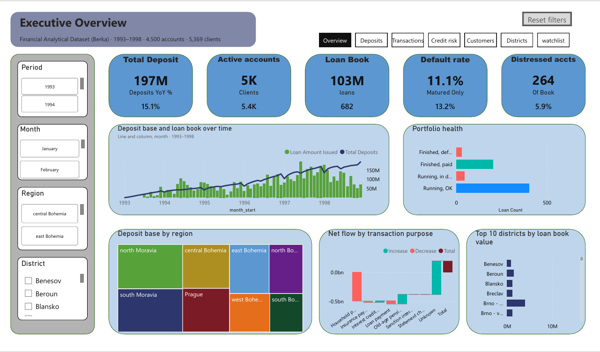

# Czech Retail Banking Analytics, 1993 to 1998

End to end analytics on the Berka PKDD'99 Financial Dataset, from eight raw `.asc` files to a seven page Power BI dashboard. 1,056,320 transactions across 4,500 accounts of a Czech bank.

The point of the project was to build the whole chain myself rather than one part of it: ingestion and profiling in Python and DuckDB, a star schema, derived analytical tables, then the semantic model and dashboard in Power BI.



## Stack

Python, DuckDB, SQL, Power BI (Power Query, DAX), parquet.

## Pipeline

Four notebooks in `Notebooks/`, run in order. All four write to one shared `berka.duckdb`.

| Notebook | What it does |
|---|---|
| `berka_00_acquire_raw` | Downloads the eight `.asc` files and checks row counts against the published dataset |
| `berka_01_ingest_profile` | Loads raw tables, profiles missingness and cardinality, writes the profile CSVs in `Step01_Ingest/` |
| `berka_02_star_schema` | Builds the dimensions, the bridge, and the transaction fact |
| `berka_03_derived_tables` | Builds balance snapshots, the loan cohort, account behaviour, and the distress table, then exports parquet |

The raw files, the `.duckdb`, and the parquet exports are not in this repo. They are all reproducible from notebooks 00 and 01, and together they run to well over 100 MB. Run the notebooks in order and you get the same database.

## Model

Six dimensions, one bridge, five facts.

| Table | Rows |
|---|---|
| `fact_transaction` | 1,056,320 |
| `fact_balance_snapshot` | 185,615 |
| `fact_order` | 6,471 |
| `fact_account_behaviour` | 4,500 |
| `fact_loan_cohort` | 682 |
| `account_distress` | 264 |

Dimensions are `dim_date`, `dim_account`, `dim_client`, `dim_district`, `dim_card`, `dim_transaction_type`, plus `bridge_disposition` to handle the owner and disponent relationship between clients and accounts.

Seventeen relationships, all many to one and single direction. Four are inactive and activated through `USERELATIONSHIP` for role playing dates: account opening, card issue, client district, and first distress date. `dim_date` is marked as the date table on `full_date`, with auto date/time and autodetect relationships both turned off.

Parquet loads into Power BI through a `FolderPath` parameter, so the model repoints to a new location by editing one parameter instead of every query.

## Data cleaning and ETL decisions

Raw load uses `all_varchar=true`. Letting DuckDB guess types on ingest hides bad rows behind silent coercion, so every type decision is applied explicitly afterwards and is visible in the notebook.

Not every NULL is missing data. `trans.operation IS NULL` corresponds exactly to interest postings, the rows where `k_symbol = 'UROK'`. That is structural, not a data quality problem. The junk dimension joins use `IS NOT DISTINCT FROM` rather than `=` so those NULL keyed rows survive the join instead of dropping out.

`days` and `rows` are reserved words in DuckDB and were renamed `n_days` and `row_count`. `Current` is reserved in DAX, handled with an underscore prefix convention.

Profiling output for each stage is committed as CSV: `Step01_Ingest/profile_missingness.csv` and `profile_rowcounts.csv`, `Step02_Model/model_table_sizes.csv`, `Step03_Derived/parquet_manifest.csv`. Those are the row count checks the pipeline was validated against.

## Dashboard

Seven pages: Executive Overview, Deposits and Balances, Transactions and Cash Flow, Credit and Loan Risk, Customers and Products, Districts and Socio-economics, Distress Watchlist. Two hidden tooltip pages, `TT_District` and `TT_Account`.

77 DAX measures. The ones worth looking at are the semi-additive balance measures using `LASTNONBLANKVALUE`, the bridge measures using `CROSSFILTER` to count clients through the disposition table, dynamic segmentation off a disconnected balance band table, and the what if scenario parameters. Full list in `docs/berka-dax-summary.md`.

The `.pbix` is in `PowerBi/`. It opens against the parquet folder, so set the `FolderPath` parameter to wherever you exported yours.

## Findings

**Loan size predicts default far better than loan term.** Under 100K CZK defaulted at about 7% (n=305), 100K to 250K at about 9% (n=251), above 250K at about 23% (n=126). Overall default rate is 11.1%, 76 of 682 loans.

The first version of that table split by term and amount together and looked much noisier. The problem was right censoring. Loans issued late in the window had not had time to default yet, so the longer term bands were counting live loans as clean ones. The model now reports `[Default Rate]` and `[Default Rate (Matured Only)]` side by side so the difference is visible rather than hidden.

**Sanction interest is a symptom, not a predictor.** Accounts that hit distress do so after origination, which means sanction interest tells you an account is already failing. It is not usable as an origination time credit signal, and treating it as one would leak future information into the model.

**Unemployment does not explain default at district level.** Pearson r is about 0.04 across 65 districts with at least 5 loans each. A null result, but a real one. District level rates are noise dominated anyway, with a median of 7 loans per district against 84 in Prague.

**Two independent paths agree.** Cumulative net transaction flow comes to 197,151,289 CZK and total closing balance to 197,140,234 CZK for December 1998, a gap of 0.006%. The transaction ledger and the balance snapshots are computed separately, so that agreement is the main check that the pipeline is sound.

## Caveats

The dataset ends in 1998 and the loan book is small, 682 loans. Default rates by segment carry real sampling error at that size and the district level breakdowns should be read as indicative rather than conclusive. Right censoring affects anything cohort based near the end of the window.

## Repo layout

```
Notebooks/        four pipeline notebooks
Step01_Ingest/    profiling output
Step02_Model/     star schema table sizes
Step03_Derived/   parquet manifest
PowerBi/          .pbix file
docs/             DAX summary and project documentation
```

## Data source

Berka PKDD'99 Financial Dataset, released for the 1999 Discovery Challenge. Anonymised records from a Czech bank covering 1993 to 1998.
